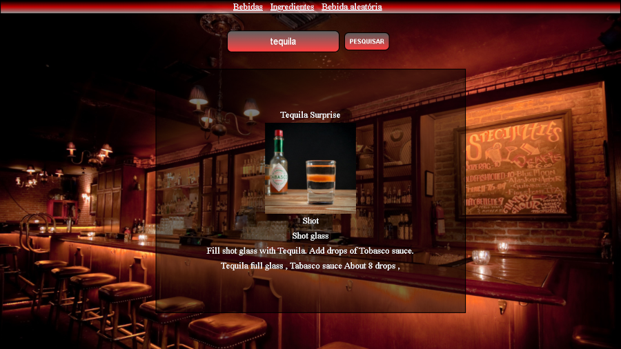

# API-bebidas

* Criei um site de requisição de dados de bebidas
* Fiz uma requisição de api do site https://www.thecocktaildb.com/
* Site responsivo com Media Queries
* Foi usado apenas HTML, CSS e Java Script puro
* Link do site https://dulipe.github.io/API-bebidas/

## indice

* O site tem três paginas, a primeira para pesquisa atraves de bebidas a segunda para pesquisa atraves de ingredientes, a terceira gera uma bebida aleatória
* No menu você tem acesso as três paginas
* digite o nome da bebida ou ingrediente que busca, e clique em pesquisar
* clique em uma bebida especifica para ter informações mais detalhadas
